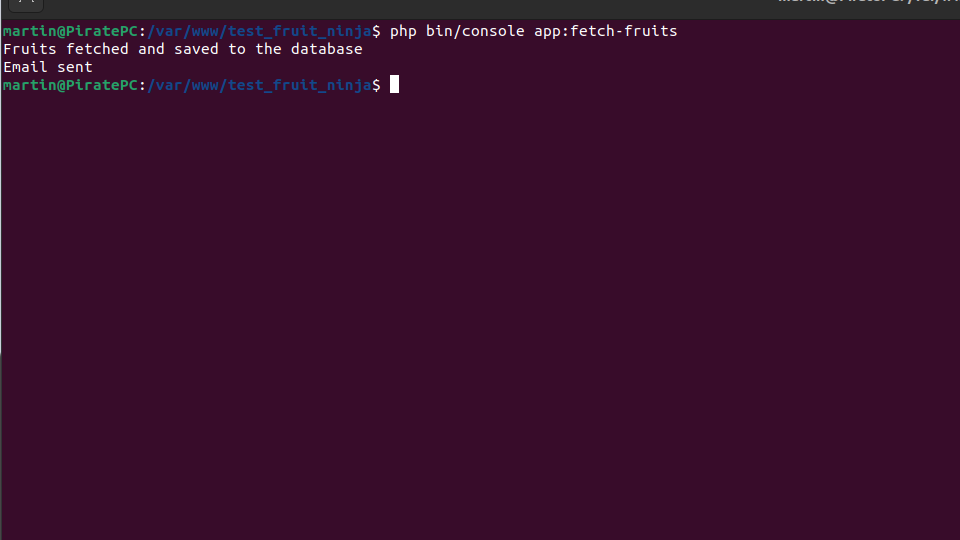

# test fruit NInja

simple test using symfony 6 and vue 3, Typescript, Tailwindcss, MySQL, Docker, Github Actions, PHPUnit, Cypress, and more.


### missing and incomplete

> **List of incomplete tasks:**
>
> -Email sending notifcation to the user is incomplete.
>
> -units tests are not implemented yet.
>
> -docker images and github actions are not available.
>
>  -the project is not deployed yet.
>
> -integration tests are not implemented yet.
>
> -UI tests and authentication are not implemented yet.

### Running the CI locally

The CI can run on a local machine using the following instructions:

- Setup a Fedora/RHEL/CentOS-Stream VM (recently tested on Fedora 35 and CentOS-Stream 8)
    - clone the repo.
    - create a mysql database instance.
    - Run the bash following commands
      ```bash
      $ composer install
      
      $ cp .env.example .env # to create the .env file
      
      $ npm install
      
      $ npm run dev # to compile the assets
      
      $ bin/console doctrine:migrations:migrate  # to create the database tables
      
       $ php bin/console app:fetch-fruits # to fetch the fruits from the API
      
      $ symfony server:start

      ```

Open the application in a web browser:

- http://localhost:8000

samples
all fruits are imported from the API


Home page with the fruits

   
Add to Favorite alert


Remove from Favorite alert


Filter by Fruit Name


Filter by Fruit Family


fruit details page

